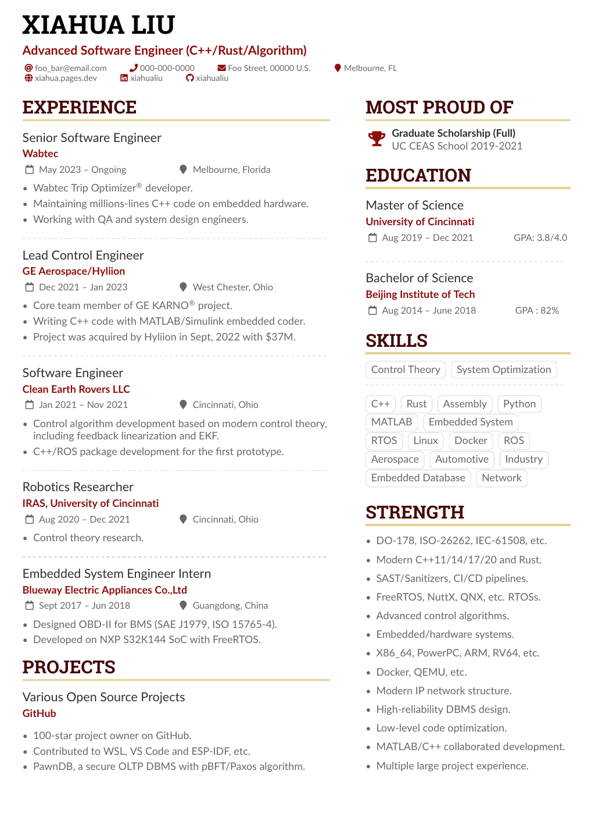

[](https://github.com/xiahualiu/my-resume/actions/workflows/build.yaml)

# My Resume

This project contains the LaTeX source code for building my resume.

The resume template used is [AltaCV](https://github.com/liantze/AltaCV), you can also find it on Overleaf.

Some sensitive information such as my phone number and address are not populated in the source code.


## Build

### Requirement

* the latest [TexLive](https://tug.org/texlive/) package.

### Build Command

```bash
pdflatex main.tex
```

## Preview



## Get the latest PDFs

You can find the latest PDFs as artifacts from the [GitHub Action](https://github.com/xiahualiu/my-resume/actions) page.

Choose the latest workflow run there, then download the artifact.
